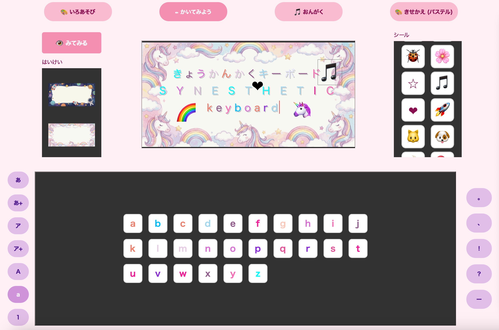

<div align="center">
  <a href="README.md">🇺🇸 English</a> |
  <a href="README.pt.md">🇧🇷 Português</a> |
  <a href="README.ja.md">🇯🇵 日本語</a>
</div>

---

# 🎹 Synesthesia Keyboard



A virtual keyboard for little people with grapheme-color synesthesia.

There's a playing card game called 7-5-3: basically, when these cards appear, you have to grab them. The other day, while playing this with my daughter, I found it strange that she kept trying to grab the 2. I gave a shallow explanation about the difference between both and went to wash the dishes. Then she comes back with her sketchbook with the numbers 7 (yellow), 5 (green), 3 (blue), and 2 (red) painted, and explains to me that she confuses the 5 of diamonds and hearts with the 2 because the 2 is red. I made a question mark face, while my partner made an exclamation mark face and enthusiastically explained that it's synesthesia: I remembered my college days when I still had the creativity left to illustrate landscapes in response to the taste of things.

Taking advantage of the fact that I had to create some application using my newly acquired programming knowledge, I decided to create an app to map the colors of letters according to her perspective. Since it seems to be a common phenomenon, I decided to make the code and data available to anyone interested. I hope it helps people tune into each other at least 3 quarks apart.

## ✨ Features

Basically, it's a keyboard with alphanumeric characters and the Japanese syllabary featuring two modes. In "colors" mode, you can define a color for each character.
In "write" mode, you can draft a brief text using the custom keyboard. So the whole process doesn't get too boring, I added a button to play a background sound and another to change the interface's color configuration. So the letter doesn't look bland, you can change the background paper and finish the decoration with stickers. With the letter finished, press "view" to see the final result, and if you like it, just download it.

* **🎨 Color choice:** the initial idea was to make a color wheel with a gradient so the choice would be freer, but I ended up opting for a simpler version with direct color selection. I used the palette of [traditional colors of Japan](https://www.colordic.org/w) as a reference: the respective name appears over each color.

* **🔉 Character sound:** I chose to use an app ([VOICEVOX](https://voicevox.hiroshiba.jp/)) to generate the character sounds. If you need refined control over each consonant and vowel of the Japanese language, it's very good software. I will continue my search for a good library because my thing is process automation, but for those who produce material, it's a great tool.

* **🏳️‍🌈 Paper themes:** it was hard to control the image result by throwing the prompt straight into Nano Banana. Giving the instructions first to Gemini and then asking it to create the illustration results in images closer to what is desired. I am thinking of looking for some free image library or a fractal generator to automate image creation. Or transforming into ASCII (for example: [ascii_magik](https://github.com/LeandroBarone/python-ascii_magic/)). The images generated by Gemini are extremely heavy, so I used the "quantization" process from the PIL|pillow library to shrink the images without losing quality.

* **🍭 Stickers:** if I could automate image generation, I was thinking of creating stickers, but since there was no time to explore the topic, I opted to use emojis. Example of an [emoji list](https://gohugo.io/quick-reference/emojis/) to use with markdown.

* **🎶 Background music:** I used the [music21](https://music21.org/music21docs/) library for music production in MIDI format. For arrangements and MP3 conversion, I used [musescore](https://musescore.org/ja) for convenience. I had to use the pygame library to play the songs in the app because PyQt5's native function was causing an encoding conflict.

* **🌤️ Screen mode:** this is a feature created to explore qss files from the PyQt5 library, which is practically the same as css3. The variations were automatically generated via prompt engineering.

* **🇯🇵 🇧🇷 🇺🇸 Translation:** upon initializing the app, you can choose between three languages: English, Japanese, and Portuguese. Since the volume of information is small, I opted to create a dictionary containing the translations.

* **🍡 Color profile:** I created three color profiles as an example. For each new profile, a new JSON file is generated that automatically registers each color definition. Visual memory for the future.

## 🛠️ Tech Stack

* **Language|version:** Python 3.13.5
* **UI Framework:** PyQt5 (QSS for styling)
* **Audio Engine:** `pygame`
* **Music Logic:** `music21`
* **Asset Processing:** `Pillow` (PIL)
* **AI assistant:** Gemini 3.0

## 📂 Project Structure

```text
SynesthesiaKeyboard/
├── main.py                 # Structure and initialization
├── requirements.txt        # Libraries
├── src/                    
│   ├── config.py           # Variables
│   └── widgets.py          # Functions
└── assets/                 
    ├── bgm/                # MP3|WAV
    ├── modes/              # QSS
    ├── profiles/           # JSON
    ├── sounds/             # WAV
    └── themes/             # PNG
```

## 🚀 Getting Started

### Prerequisites

Make sure you have [Python 3](https://www.python.org/downloads/) and `git` installed on your machine.

### Terminal Installation (MacOS)

1. Clone the repository:
   ```bash
   git clone [https://github.com/mitinisan/SynesthesiaKeyboard.git](https://github.com/mitinisan/SynesthesiaKeyboard.git)
   cd SynesthesiaKeyboard
   ```

2. Install the required libraries:
   ```bash
   pip install -r requirements.txt
   ```

3. Initialize the application:
   ```bash
   python main.py
   ```

## Flaws

Overall the application fulfills its purpose, but it's not perfect and has a series of flaws that need to be fixed.
If you really want me to fix them, buy me a chai and we can talk.
By tearing it down and debugging you learn a lot, so my friend: good luck!